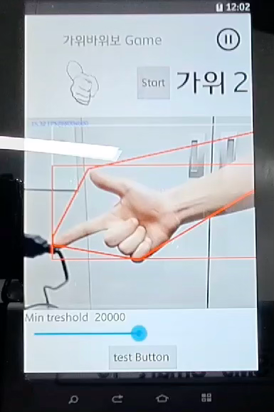

<!-- TOC -->
* [미니게임 천국 (Mini Game Heaven)](#-미니게임-천국-mini-game-heaven)
  * [소개](#-소개)
    * [주요 게임](#주요-게임)
  * [주요 기능](#-주요-기능)
    * [가위바위보 게임](#-가위바위보-게임)
      * [RspActivity(가위바위보 게임 액티비티)](#rspactivity가위바위보-게임-액티비티)
  * [기억력 게임](#-메모리-게임)
  * [스네이크 게임](#-스네이크-게임)
  * [랭킹 기록 및 이미지 처리](#-이미지-처리-및-랭킹)
    * [추가 기능 및 향후 개선 사항](#-추가-기능-및-향후-개선-사항)
  * [라이선스](#-라이선스)
<!-- TOC -->

# 키오스크 미니게임(Kiosk Mini Game)

## 소개

**미니게임 천국**은 **Android 하드웨어 기능(GPIO, 카메라, OpenCV 등)** 을 활용하여 간단하면서도 인터랙티브한 게임을 제공하는 프로젝트입니다.  
JNI 및 OpenCV를 활용하여 영상 처리와 하드웨어 제어를 통합한 다양한 게임을 구현하였습니다.

### 주요 게임

- **가위바위보 게임**: OpenCV를 이용한 손 동작 감지 기능 구현
- **메모리 게임**: LED와 JNI를 이용한 기억력 테스트 게임
- **스네이크 게임**: GPIO 버튼을 활용한 전통적인 스네이크 게임

---

## 주요 기능

### 가위바위보 게임

- **OpenCV Color Blob Detection**을 활용한 손 인식
- **HSV 색 공간**을 사용하여 피부 색상 감지
- **Gaussian Blur & Edge Detection**을 통한 영상 전처리
- **SeekBar** UI를 활용하여 감도 조정 기능 제공

#### RspActivity(가위바위보 게임 액티비티)

가위바위보 게임의 동작 방식:

1. **`onTouch()` 메서드 오버라이드**
    - 화면에서 터치된 위치 (X, Y) 값을 가져옴
2. **손의 평균 색상 계산**
    - OpenCV를 이용하여 특정 영역의 색상을 추출하고, HSV 색 공간으로 변환
3. **영상 처리 적용**
    - Gaussian Blur와 Edge Detection을 통해 손 모양을 명확히 감지
4. **게임 판정**
    - 감지된 손가락 개수를 기준으로 "가위, 바위, 보" 판정

[RspActivity.java](app/src/main/java/com/example/minigame/RspActivity.java) – OpenCV 연동 및 게임 로직 구현

- **카메라 프레임을 받아 영상 처리**
- **JavaCameraView 활용** (OpenCV와 Android Camera를 연결하는 역할)
- **SeekBar**로 감도 조절
- **게임 결과 화면에 표시**

  

---

## 기억력 게임

- **JNI를 활용하여 LED 패턴을 점등**
- **사용자가 LED 점등 순서를 기억하고 입력**
- **CountDownTimer를 활용하여 제한 시간 설정**
- **정답을 입력하면 난이도가 증가하고, 오답 시 `GameOverActivity.java`로 이동**

**게임 방식**

1. LED가 특정 패턴으로 점등됨
2. 사용자가 같은 패턴을 버튼으로 입력
3. 정답이면 난이도 증가, 오답이면 게임 종료 후 점수 저장

---

## 스네이크 게임

- **JNI를 활용하여 버튼 입력 감지**
- **Handler & Looper를 사용하여 실시간 입력 감지**
- **Canvas & SurfaceView를 이용한 스네이크 애니메이션 구현**

1. **Canvas에 스네이크를 그리기**
    - `drawCircle`, `drawColor` 메서드를 활용하여 뱀의 위치 업데이트
2. **SurfaceView를 이용한 애니메이션 구현**
    - SurfaceHolder를 사용하여 반복적으로 화면을 갱신
3. **버튼 입력을 통해 방향 변경**
    - GPIO Up, Down, Left, Right 키 입력 감지

---

## 랭킹 기록과 이미지 처리

- **게임 내에서 카메라를 사용하여 이미지를 캡처**
- **OpenCL을 활용하여 Gaussian Blur, Edge Detection 적용**
- **GameInfo를 활용하여 플레이어 랭킹을 관리**
- **RecyclerView를 이용한 랭킹 리스트 표시**

  

---

### 추가 기능 및 향후 개선 사항

- **AI 기반 손 모양 인식 개선**
- **멀티플레이 모드 지원**
- **UI/UX 디자인 개선**

---

## 라이선스

본 프로젝트는 MIT 라이선스를 따릅니다.
